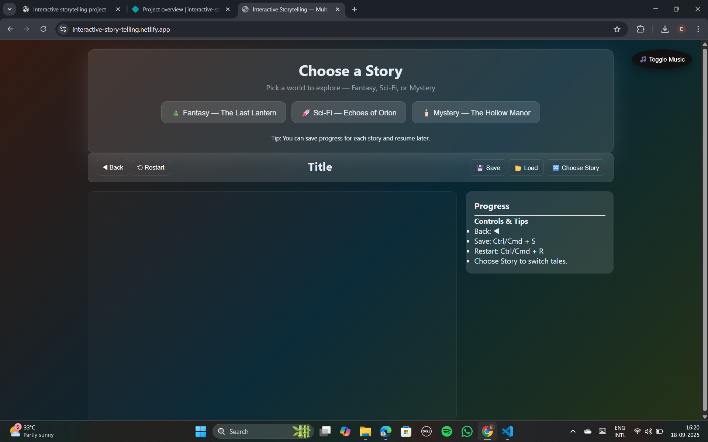
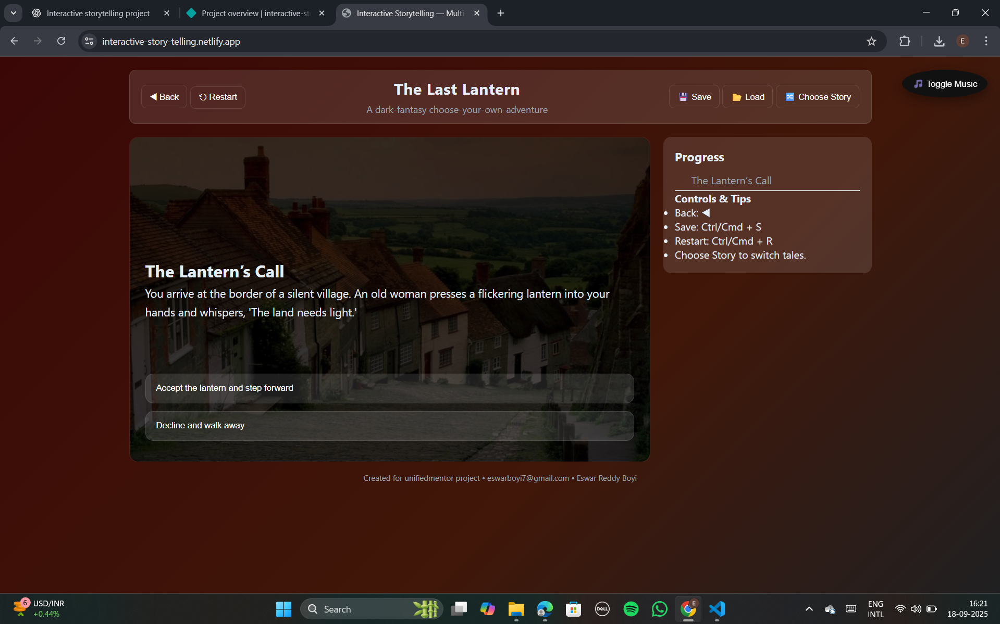

### Interactive Storytelling Web App

An immersive choose-your-own-adventure style web application built with HTML, CSS, and JavaScript.
Users can explore different story paths, make decisions, and experience dynamic visuals with a dark-themed animated background.

 -------------------------------------------------

### Live Demo

https://interactive-story-telling.netlify.app/

 -------------------------------------------------

### Features

📖 Branching Narrative – A story with multiple decision points where users choose their path.

🎭 Dynamic Choices – Buttons update content dynamically based on user decisions.

🎨 Dark Animated Background – Smooth multi-color gradient animations for a moody atmosphere.

🖼️ Fixed-Sized Story Area – Consistent layout with fixed width/height for story images and text.

🌑 Image Transparency Overlay – Dark overlay ensures readability of text over background images.

🎵 Background Music Toggle – Optional music player with toggle button.

📱 Responsive Design – Works across desktop and mobile with adaptive layouts.

🧭 Breadcrumb Navigation – Allows users to revisit previous story choices.

🔔 Toast Notifications – Smooth feedback messages for user interactions.

 -------------------------------------------------

### Tech Stack

***Frontend:***

HTML5

CSS3 (Flexbox, Grid, Animations, Gradients, Glassmorphism effects)

JavaScript (DOM manipulation, dynamic rendering, navigation logic)

***Design Patterns:***

Responsive layout

Dark theme with animated gradients

Overlay layers for readability

 -------------------------------------------------

***How It Works***

The story area (#story-area) is fixed at 800x500px for consistency.

Each story segment is displayed with a background image and overlay text.

Users make choices via buttons, triggering JavaScript functions to load the next story segment.

A dark overlay ensures text is always readable, regardless of background image.

The gradient background animates continuously, creating an engaging mood.

 -------------------------------------------------

### Styling Highlights

Glassmorphism Cards – Transparent, blurred panels for UI elements.

Animated Gradient Background – Multiple dark color stops transitioning smoothly.

Responsive Scaling – Story area adjusts gracefully on smaller screens.

Hover & Focus Effects – Interactive feedback on story buttons.

 -------------------------------------------------

### Screenshots

<table>
  <tr>
    <th> Index Page</th>
    <th> Story Page</th>
  </tr>
  <tr>
    <td> </td>
    <td> </td>
  </tr>
</table>

 -------------------------------------------------
 
### Getting Started

***Clone the repository***
````
git clone https://github.com/EswarReddyBoyi/Interactive-Story-Telling
cd interactive-story
````

***Open in browser***

Simply open index.html in your favorite browser.

No server setup required .

### Usage

Start from the homepage where you pick a story.

Read the narrative text and choose between multiple options.

Follow the branching paths to discover different story endings.

Use the restart button to play again with new choices.

### Responsive Design

On desktop → Fixed-width story area with sidebar.

On mobile → Story area adapts full width with adjusted height.

 -------------------------------------------------

### Future Enhancements

📝 Add more story branches & endings

🎶 Multiple soundtracks for different story moods

🌍 Save progress in local storage

💾 Export story choices as a PDF log

👤 User login & custom stories

### Author

Developed by Eswar Reddy Boyi

Contact: eswarboyi7@gmail.com


### License

This project is licensed under the MIT License – feel free to use, modify, and distribute.


